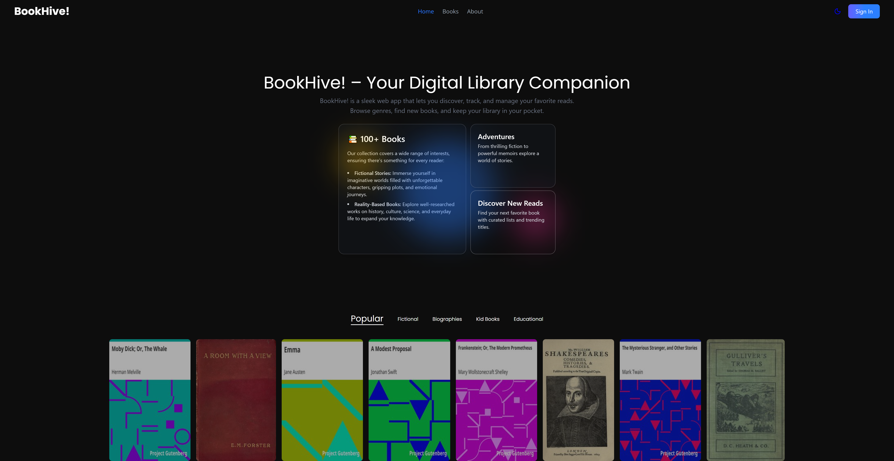

# BookHive

<!--
GitHub Topics:
bookhive, project-gutenberg, free-books, literature, ebook-reader, reactjs, firebase, redux, react-router, gutenberg-api, reading-app, open-source
-->

📚 **BookHive** is a free, open-access reading platform that brings classic literature to your fingertips.  
Powered by the **Project Gutenberg** library, BookHive lets readers explore and enjoy timeless books without cost.

Readers can create an account, add favorite books to their personal list, and continue reading anytime.

---

## 🚀 Features

- Free Access to Literature – Browse and read classic books from the Project Gutenberg collection.
- User Authentication – Secure sign-up and login system using Firebase Authentication.
- Favorites – Save your favorite books for quick access later.
- Seamless Reading – In-browser reader with a smooth experience for EPUB files.
- Responsive Design – Optimized for desktop, tablet, and mobile devices.
- State Management – Powered by Redux for efficient global state handling.

---

## 🛠️ Tech Stack

- Frontend: React.js, React Router, Redux
- Backend & Auth: Firebase Authentication & Firestore Database
- Book Data Source: Project Gutenberg (https://www.gutenberg.org/)
- Styling: Tailwind CSS (optional if used)
- Hosting: Firebase Hosting / Vercel

---

## 📦 Installation

1. Clone the repository
   git clone https://github.com/Celestial00/bookhive.git
   cd bookhive

2. Install dependencies
   npm install

3. Set up Firebase

   - Go to https://console.firebase.google.com/
   - Create a new project
   - Enable Authentication (Email/Password)
   - Enable Firestore Database
   - Get your Firebase config keys and create a `.env` file:

     REACT_APP_FIREBASE_API_KEY=your_api_key
     REACT_APP_FIREBASE_AUTH_DOMAIN=your_auth_domain
     REACT_APP_FIREBASE_PROJECT_ID=your_project_id
     REACT_APP_FIREBASE_STORAGE_BUCKET=your_storage_bucket
     REACT_APP_FIREBASE_MESSAGING_SENDER_ID=your_sender_id
     REACT_APP_FIREBASE_APP_ID=your_app_id

4. Start the development server
   npm start

---

## 📂 Project Structure

bookhive/
│── public/ # Static files
│── src/
│ ├── components/ # UI components
│ ├── pages/ # Page views (Home, Reader, Favorites, etc.)
│ ├── redux/ # Redux slices and store
│ ├── routes/ # React Router route definitions
│ ├── firebase.js # Firebase configuration
│ └── App.js # Main app component
│── .env # Environment variables
│── package.json

---

## 📸 Screenshots

---

## 🌟 Contributing

We welcome contributions!
If you'd like to improve BookHive, feel free to fork the repo and submit a pull request.

---

## 📜 License

This project is licensed under the MIT License.
Book content is sourced from Project Gutenberg, which is in the public domain.

---

## 💡 About

BookHive is built to make timeless classics accessible to everyone, anywhere, for free.
Read, explore, and cherish the world’s literature without limits.
